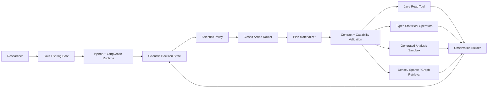

<div align="center">

# Mico

### An observation-driven scientific agent harness for microbiome research

[](#architecture)
[](#architecture)
[](#data-and-safety-boundary)
[](#evidence-layer)

**From a research question to traceable data, analysis, evidence, and limitations.**

</div>

---

## Why Mico?

Scientific questions rarely follow a single fixed workflow. A useful agent
must look at what was actually observed, decide what can be done next, run a
bounded operation, and update its understanding from the real result.

Mico is built around that loop:

```text
Research question
      │
      ▼
Scientific Decision State ──► Policy selects one safe Action
      ▲                                  │
      │                                  ▼
Observation Builder ◄── Java / Python / Evidence execution
```

The result is an agent harness designed for reproducibility and inspection,
not a free-form chatbot with database access.

## Highlights

| | Capability | What it means |
| --- | --- | --- |
| 🧭 | Observation-driven policy | Decisions consume a compact six-block scientific state, never raw database rows. |
| 🧱 | Fixed scientific action space | Ten closed actions cover cohort inspection, read queries, comparison, adjustment, validation, evidence, and finish. |
| 🔐 | Java data boundary | Models generate semantic plans; Java validates, compiles, and executes bounded read-only access. |
| 📊 | Feature-aware statistics | Sample-level, multi-feature analysis supports FDR-aware group comparison and confounder adjustment. |
| 🧪 | Typed + generated analysis | Standard methods use typed operators; approved long-tail analyses run through a constrained generated-program sandbox. |
| 🧬 | Hybrid evidence retrieval | Dense, sparse, and GraphRAG branches preserve source chunks, path provenance, and evidence direction. |
| 🧾 | Objective lifecycle | Objectives can be active, completed, or blocked by a real data limitation—without inventing missing capabilities. |
| 🔎 | End-to-end observability | Every decision, plan, capability decision, result, and limitation can be attributed in the trace. |

## Architecture



## Scientific action space

Mico keeps high-level scientific intent separate from low-level execution.
The policy can only select from this fixed action set:

```text
inspect_cohort          execute_read_query
compare_groups          analyze_projection
stratified_analysis     adjust_confounders
cross_project_validate  cross_disease_validate
retrieve_evidence       finish
```

The runtime determines only whether an action is technically executable in
the current state. It does not choose the scientific route for the policy.

## The decision state

Policy input is a stable, structured contract:

```json
{
  "task": {},
  "data_state": {},
  "analysis_state": {},
  "evidence_state": {},
  "progress": {},
  "action_space": {}
}
```

This keeps raw rows, patient identities, provider credentials, executable
plans, and runtime-only diagnostics outside the policy boundary.

## Data and safety boundary

```text
Model intent
  → catalog-bound QueryPlan / AnalysisPlan
  → contract validation
  → Java read-only compiler or approved analysis executor
  → structured observation
```

- No raw SQL from a model is executed directly.
- No business-database credential is stored in this repository.
- Data access is bounded, read-only, and audited.
- Sample-level identity is represented by a run-scoped opaque analysis key.
- Typed execution never silently falls back to generated code after failure.
- Generated analysis runs with a limited input schema, AST validation,
  resource limits, and result validation.

## Evidence layer

```text
Dense vectors ─┐
Sparse search ─┼──► source-bound fusion ───► evidence summary
Graph paths  ──┘
```

Evidence is not treated as automatically supportive simply because documents
were retrieved. The runtime tracks supporting, conflicting, and contextual
evidence separately, preserving source chunks and graph paths for review.

## Completion semantics

| State | Meaning |
| --- | --- |
| `workflow_completed` | The agent reached its terminal action. |
| `analysis_execution_completed` | An executor finished its requested work. |
| `scientific_result_valid` | The returned result passed its structural validation. |
| `scientific_conclusion_eligible` | The result is allowed to support a scientific conclusion. |
| `limitations_present` | A real data or capability boundary remains visible in the final answer. |

If a requested cross-project analysis is impossible because the current cohort
has no project dimension, the agent can finish with a recorded limitation
rather than fabricating a validation result.

## Repository layout

```text
mico_database_new/
├── mico_database_new/    # Java/Spring Boot data and tool boundary
├── mico-agent-runtime/   # Python/LangGraph scientific agent runtime
├── mico_ai_service/      # Supporting AI orchestration components
└── docs/                 # Architecture and data-contract documentation
```

## Quick start

Mico has separate Java and Python components. Configure credentials and
service addresses through your local deployment environment—never commit them
to the repository.

```bash
cd mico-agent-runtime
python -m pip install -e ".[test]"
pytest
```

For architecture, safety, and contract details, start with:

- [Scientific exploration agent design](mico-agent-runtime/docs/agent-runtime/p2j-scientific-exploration-agent-plan-v1.md)
- [Generated analysis closure](mico-agent-runtime/docs/agent-runtime/generated-analysis-closure-v1.md)

## Scope

Mico is a research-analysis and decision-support harness. It is not a
clinical diagnostic or treatment system. Evidence, statistical results, and
limitations are kept distinct so downstream users can review their basis.
