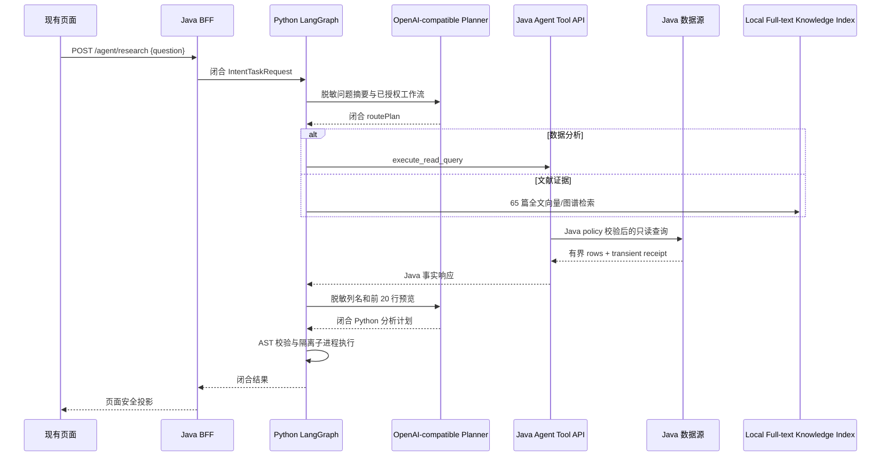

# Mico 自然语言动态科研分析主链路（当前边界说明）

本文只描述当前动态主链的边界。文中任何历史演示、固定疾病或固定统计实验均不构成可调用工作流；开放式科研问题必须由当前 LangGraph 状态和模型计划动态决定下一步。

校准说明：Java active Catalog 当前包含两个闭合能力：metadata-only
`describe_read_schema` 与业务数据执行 `execute_read_query`。后者仍是唯一
业务数据执行边界；任何把 Catalog 写成只注册一个工具的旧句子均按历史快照理解。

## 目标

项目当前只保留一条业务分析主链：

```text
自然语言问题
  → LangGraph 意图识别
  ├─ 文献/机制问题 → 全文向量 + 来源图谱 → 带 PMCID/chunk 的证据
  └─ 数据/分析问题 → Planner 生成受限 SQL 草案 → Java 只读查询
                       → Python 生成代码并沙箱分析
```



## 动态并不等于无边界

模型可以根据自然语言问题提出 SQL，但 SQL 不是事实、不是权限，也不由
Python 执行。Java 是唯一业务事实源，负责最终验证、只读连接、超时、行数
上限、禁止写操作/DDL/跨库/文件导出和安全错误映射。Java 当前注册
metadata-only 的 `describe_read_schema` 与数据执行的 `execute_read_query`；浏览器不能提交 SQL、表名、scope、数据库地址或 Runtime
Token。

模型配置只从运行环境读取：

```text
MICO_RESEARCH_PLANNER_BASE_URL
MICO_RESEARCH_PLANNER_MODEL
MICO_RESEARCH_PLANNER_TOKEN
```

缺少或不完整配置时使用明确标记的 `deterministic` 模式。该模式不冒充模型
规划；数据分析没有可验证 SQL 草案时会安全返回 `QUERY_PLAN_REQUIRED`，文献问题
可以安全选择本地 `knowledge_retrieval` 路由，不会猜测数据查询或伪造证据。

## Python 动态分析边界

Python 只接收 Java 返回的有限 `columns`、有界 `rows` 和真实 transient receipt。
模型看到的仅是已脱敏的前 20 行。模型返回闭合 Python 计划；Runtime 仅允许有限
AST 节点、有限内建函数和 `result` 结构，并在 `python -I -S`、无环境变量、无网络
子进程中执行。原始 payload、定位器、样本 accession、SQL、Token、连接信息和
自由 Java warning 不进入报告、审计或页面。

## 保留的基础能力

独立 Runtime PostgreSQL/目前 MySQL 适配层、加密恢复状态、LangGraph checkpoint
接口、暂停/取消/审批端口和通用文献元数据召回资产保留，作为后续生产化能力；
它们不改变当前核心查询主链，也没有在本次改动中启动服务或连接数据库。

## 明确不在当前主链

固定 T2D/健康队列、固定差异统计、样本专用两步调查、P3 统计页面及其演示/实验
测试链已移除，不再作为可调用工作流。将来如有新的科研需求，应由新的闭合契约和
模型计划进入同一动态查询/分析边界，而不是恢复旧的硬编码路由。

这是科研数据分析辅助，不是临床诊断、治疗、处方、因果证明或患者识别系统。
