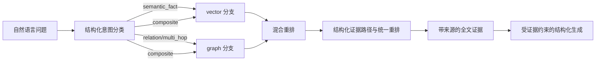

# P2-E：65 篇全文知识检索与 GraphRAG 核心方案 v2

## 当前语料边界

本版本只使用仓库中已经导入的 65 篇全文文献，不把摘要和纯元数据混入正式全文证据库。

当前资产：

- 65 篇全文文献；
- 3,617 个全文分块；
- 11 个主题标签；
- 每个结果保留 PMCID、PMID、章节、分块 ID、来源 URL 和 `evidenceTier=fulltext`。

## LangGraph 检索路由



Planner 只输出闭合的 `queryType`、`routeConfidence`、`retrievalMode` 和
`retrievalBranches`，不输出工具参数、版本或原始数据：

| queryType | 允许分支 | 语义 |
|---|---|---|
| `semantic_fact` | `vector` | 文献事实和语义检索 |
| `relation` | `graph` | 明确关系、机制或关联 |
| `multi_hop` | `graph` | 需要一至三跳来源路径 |
| `composite` | `vector + graph` | 同时需要语义召回和关系路径 |

`composite` 会并行执行两个检索分支，再进入统一重排器。结果保留
`retrievalSources`、`vectorScore`、`graphScore`、`rerankScore` 和 `graphPaths`，
不会把单路分数误当作最终证据分数。

### 向量侧

生产向量后端使用 `gemini-embedding-2`。当前首版索引按论文（PMCID）生成
一个向量，而不是为 3,617 个分块逐一调用模型；查询格式为
`task: search result | query: {content}`，文档格式为
`title: {title} | text: {fulltext_content}`，查询和论文向量统一使用余弦相似度。
论文向量命中后，再回到既有全文分块和 GraphRAG 来源边选择具体证据分块，
因此最终结果仍保留 `sourceChunkId` 和可追溯来源。

离线环境保留 `fulltext-tfidf-cosine-v1` 基线，只有显式选择 `tfidf` 时才使用；不会在 Gemini 后端缺失索引或密钥时静默降级。

Gemini 配置只从环境读取：

```text
MICO_GEMINI_EMBEDDING_ENABLED=true
MICO_GEMINI_EMBEDDING_MODEL=gemini-embedding-2
MICO_GEMINI_API_KEY=<由部署环境注入>
MICO_LOCAL_KNOWLEDGE_ENABLED=true
MICO_LOCAL_KNOWLEDGE_RETRIEVAL_BACKEND=gemini
MICO_LOCAL_KNOWLEDGE_INDEX_DIR=<全文索引目录>
```

密钥不写入仓库、索引、日志或响应。

### 结构化生成

重排后的上下文只包含论文标题、受限摘要、证据 ID 和结构化图路径；
不把原始业务定位值或丰度 payload 送入生成器。配置
`MICO_GRAPH_RAG_GENERATOR_BASE_URL`、`MICO_GRAPH_RAG_GENERATOR_MODEL` 和
`MICO_GRAPH_RAG_GENERATOR_TOKEN` 后，可以使用 OpenAI-compatible JSON 生成端口；
缺少配置或模型输出无法通过 evidence/path 闭合校验时，自动降级为
`deterministic_grounded`。系统返回可审计的证据路径和 claim，不输出隐藏推理链，
也不把没有来源支撑的跳转包装成医学结论。

### 图谱侧

当前 GraphRAG 图谱是来源可追溯的版本化核心图：

- `paper`、`chunk`、`topic`、`section` 节点；
- 受控疾病/微生物组主题术语关系；
- `candidate_taxon` 候选物种关系；
- `controlled_term -> candidate_taxon` 的来源局部关联边；
- 每条边绑定 `evidenceChunkId`。

关系词、多跳词或机制词先命中图谱节点，再做有上限的双向三跳遍历，
沿 `controlled_term -> chunk -> candidate_taxon` 等路径回收全文分块。
`candidate_taxon` 由词形启发式产生，只能用于召回，不能直接作为审核后的生物医学事实。
每条路径输出结构化的实体、关系、目标和 `evidenceChunkId`；无全文分块支撑的跳转不进入结果。
路径和每个 hop 都带状态：`supported` 表示来源直接支持，`speculative` 表示候选
物种/关系仍需审核，`conflicted` 表示来源显式冲突，`partial/unsupported` 表示
链路不完整。生成器只能生成证据绑定的 `reasoningSteps + conclusion`，不能把
`speculative` 或 `conflicted` 升级为 `supported`；这不是隐藏 chain-of-thought，
而是可复查的来源步骤。
当前图谱仍不是完整的疾病—物种—功能本体，也不替代人工审核。

## 证据等级

正式生成结果只能把全文结果作为高等级证据。摘要级和元数据级结果今后可以用于候选发现，
但必须带独立的 `evidenceTier`，不能和全文混合成同等级证据。

## 与业务数据的边界

- 文献索引是外部知识证据，不覆盖 Java/远程 MySQL 的业务事实；
- Python 只读取显式配置的本地知识索引，不读取 Java 配置，不连接业务 MySQL；
- 宏基因组丰度原始行不复制进向量库或图谱；仍由 Java 受控查询；
- 20,852,714 条丰度存储行不逐行生成向量或图节点，避免索引膨胀和语义污染；
- 当前 65 篇论文对应 65 个 Gemini 论文向量，3,617 个全文分块继续作为精确证据层。
- 当前图谱版本为 `fulltext-provenance-graphrag-v2`，所有图边来源覆盖率为 100%。

## 生成与验证

```text
python scripts/build_medical_rag_index.py
python scripts/build_medical_knowledge_index.py
python scripts/build_medical_gemini_embedding_index.py --resume
```

前三步都只读取 65 篇本地全文。前两步不联网；第三步仅在显式配置 Gemini 环境变量后调用 Embedding API，不访问远程数据库、不下载新文献。

当前限制：

- Gemini 论文向量索引需要显式完成一次 API 构建；未配置密钥时只可使用离线 TF-IDF 基线；
- 图检索扩展限制为最多 16 个种子节点、4,000 次扩展和三跳，防止高连接节点导致遍历失控；
- 结构化生成只接收已重排证据和来源路径，当前确定性模式不会生成没有来源的医学结论；
- 已建立独立的本地 Docker PostgreSQL+pgvector 与 Neo4j 知识存储，并完成 65 篇全文资产入库；生产环境的账号、TLS、备份和版本切换仍待部署治理；
- 候选物种实体尚未完成规范化和人工审核；
- 多跳推理必须逐步绑定全文分块，缺证据的步骤不能生成确定结论。
- DeepSeek 兼容端口支持 `https://api.deepseek.com/chat/completions`，其他
  OpenAI-compatible 地址使用 `/v1/chat/completions`。模型凭据只从环境注入；
  JSON mode 或思考参数不被服务端支持时，仅移除可选提示，闭合 Schema 和来源绑定
  校验仍然强制执行。
