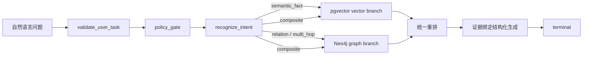

# P2-F：真实 Vector + Graph 混合检索

## 当前落地

知识检索不再把 JSONL 文件当作生产数据库。JSONL 仍然是可复现的原始索引资产和入库输入；运行时启用 database backend 后，查询实际进入两个独立存储：

```text
65 篇全文 / 3,617 chunks
        │
        ├─ PostgreSQL + pgvector
        │    knowledge_document：65 个 gemini-embedding-2 论文向量
        │    knowledge_chunk：3,617 个来源分块
        │
        └─ Neo4j
             v2 回滚/对照图：9,998 个节点、81,359 条来源关系
             v3 语义图：5,238 个节点、24,341 条关系
             v4 staging/published 图：由构建 manifest 决定
```

PostgreSQL 知识库是独立的 `mico_knowledge`，与 Runtime 状态库 `mico_agent_runtime` 分离，也与业务库 `patient_data_manager` 分离。Neo4j 只保存文献实体、分块实体、关系和证据 chunk 绑定，不保存业务患者或宏基因组原始行。

## Vector 数据库

论文向量来自 `gemini-embedding-2`，维度为 3072。由于 pgvector 的高维 HNSW 索引限制，列使用 `HALFVEC(3072)`，写入时做半精度存储，查询使用余弦距离 `<=>`。查询由 PostgreSQL+pgvector 执行。

论文级向量命中后，SQL 从对应论文的 chunk 中选择最匹配的来源文本，结果继续保留 `sourceChunkId`。

## GraphRAG 与知识图谱

GraphRAG 是检索编排方式，不是一个数据库名称。图数据实际落在 Neo4j。当前运行时默认读取版本化 v3 语义图，v2 保留用于回滚和对照；v4 已增加正式的构建、质量门禁和发布资产，但未显式切换前不会自动替换 v3：

- 节点统一标签：`KnowledgeEntity`；
- v3 节点类型通过 `entityType` 区分 `Paper`、`Chunk`、`Section`、`Topic`、`Disease`、`Taxon`、`Metabolite`、`Pathway`、`Concept`、`HostProcess`；
- 关系统一为 `KNOWLEDGE_RELATION`，具体关系存在 `relation` 属性；
- v3 语义关系还保存 `relationClass`、`confidence`、`evidenceText`、句子起止位置和标准化状态；
- v4 额外保存 `canonicalEntityId`、`ontologySource`、`ontologyId`、`normalizationStatus`、`qualityStatus` 和 `graphBuildRunId`；
- `nodeId` 唯一约束，`label` 建索引。

图检索以命中的 Disease、Concept、Metabolite、Pathway、HostProcess 或 Taxon 为种子，执行固定形状的 1/2/3 跳查询，并要求每一跳带来源 chunk 且 `confidence >= 0.65`。Taxon 仍是候选标准化实体，冲突/否定关系标记为 `conflicted`，不会在生成时升级为已证实事实。图版本由 `MICO_KNOWLEDGE_GRAPH_VERSION` 显式选择，默认值仍为 v3。

## LangGraph 动态路由



混合路由会并行执行两个后端，统一计算 `vectorScore`、`graphScore`、`rerankScore`，并保留 `retrievalSources`。当两路都有候选时，返回集保留至少一个来自每一路的证据，避免向量 Top-K 把图路径静默挤掉。

最终输出包含：

- `retrievalRoute`；
- `retrievalSources`；
- 向量/图谱/重排分数；
- `graphPaths` 和每一跳状态；
- `reasoningSteps` 与 `conclusion`；
- 文献、chunk 和来源信息。

生成器只能引用检索结果中的 evidence ID 和 path ID。没有来源的关系、候选物种或多跳推断不能输出为事实。

## 配置与入库

知识库启用需要显式注入：

```text
MICO_KNOWLEDGE_RETRIEVAL_BACKEND=database
MICO_LOCAL_KNOWLEDGE_ENABLED=true
MICO_LOCAL_KNOWLEDGE_INDEX_DIR=<rag index directory>
MICO_KNOWLEDGE_VECTOR_ENABLED=true
MICO_KNOWLEDGE_VECTOR_DATABASE_URL=<independent mico_knowledge URL>
MICO_KNOWLEDGE_GRAPH_ENABLED=true
MICO_KNOWLEDGE_NEO4J_URI=<bolt loopback URL>
MICO_KNOWLEDGE_NEO4J_USER=<injected user>
MICO_KNOWLEDGE_NEO4J_PASSWORD=<injected secret>
MICO_GEMINI_EMBEDDING_ENABLED=true
MICO_GEMINI_EMBEDDING_MODEL=gemini-embedding-2
MICO_GEMINI_API_KEY=<injected secret>
```

Docker 资产位于 `docker-compose.knowledge.yml`，只绑定本机 loopback 端口。入库使用：

```text
python scripts/ingest_knowledge_stores.py
```

脚本只读取本地全文索引，幂等写入独立 `mico_knowledge` 和 Neo4j 知识图谱，不连接 Java 业务库，不读取 `patient_data_manager`。v3 图谱使用 `scripts/build_graph_v3.py` 构建、`scripts/ingest_graph_v3.py` 追加导入；不会删除 v2 图谱。P2-G1 使用 `scripts/build_graph_pipeline.py` 生成 v4 staging 资产；通过 `scripts/publish_graph_version.py` 后才可发布，随后可使用 `scripts/ingest_graph_versioned.py --publish` 进行显式版本切换。入库只删除同一 graphVersion，不删除其他版本。

## 仍然明确的边界

- `mico_agent_runtime` 是运行状态库，不是知识库；
- `patient_data_manager` 仍只能通过 Java 受控工具访问；
- 文献图谱不是完整医学本体，候选关系需要质量评估和人工审核；
- 当前向量粒度是论文级，后续增加 chunk 级 embedding 必须重新评估成本、版本和来源对齐；
- 生产环境还需要账号最小权限、TLS、备份、图谱版本切换和增量入库策略。
