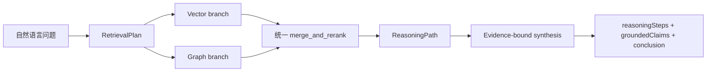

# P2-G2 Vector / Graph / Hybrid 统一检索与多跳推理

## 主链路



P2-G2 不引入新的业务数据源。向量仍来自独立 pgvector，图谱仍来自独立 Neo4j；业务事实仍只能由 Java 受控工具提供。

## RetrievalPlan

两个检索端统一接受闭合的 `RetrievalPlan`：

```text
planId
queryType
retrievalMode
retrievalBranches
topK
maxHops
minConfidence
requireEvidencePaths
graphVersion
querySummary
```

约束：

- `retrievalBranches` 只能是 `vector`、`graph`；
- `retrievalMode` 只能是 `vector`、`graph`、`hybrid`；
- `topK <= 20`；
- `maxHops <= 3`；
- `minConfidence >= 0.65`；
- 图版本必须是受限版本标识；
- 模型不能在计划中注入 SQL、Cypher、表名、数据库地址或自由过滤条件。

`planId` 由闭合计划内容稳定计算，同一计划生成同一 ID。

## 统一重排

`merge_and_rerank` 合并同一 `sourceChunkId` 的向量和图谱结果，并保留：

- `vectorScore`；
- `graphScore`；
- `retrievalSources`；
- `graphPaths`；
- `reasoningPaths`；
- `rerankBreakdown`。

重排不是黑盒分数，当前分解为：

```text
vector contribution
graph contribution
reciprocal-rank contribution
path support contribution
source diversity contribution
- hop penalty
- assertion status penalty
```

冲突和推测路径仍保留其状态，但会产生惩罚，不会被重排为确定事实。混合结果在两路都有候选时至少保留一路向量证据和一路图谱证据。

## ReasoningPath

`ReasoningPath` 是从图谱路径提升出来的严格结构：

```text
pathId
status
hops
sourceDocumentIds
confidence
hopCount
evidenceChunkIds
pathScore
```

模型校验确保：

- `hopCount == len(hops)`；
- `evidenceChunkIds` 精确对应每个 hop 的来源 chunk；
- 每条路径最多 4 个 hop；
- 每条路径至少有一个来源文档和证据 chunk；
- `supported` 不能覆盖 `speculative` 或 `conflicted` hop。

旧的 `graphPaths` 字段继续保留用于 P2-A/P2-C 兼容；`SynthesisEvidence` 会将两者同步，新代码优先使用 `reasoningPaths`。

## 结构化生成

生成器只接受检索结果中的标题、摘要和 source-bound path。输出必须通过闭合模型校验：

```text
reasoningSteps
groundedClaims
conclusion
```

每个 reasoning step 和 claim 必须引用已提供的 `evidenceId`，并且只能引用已提供的 `reasoningPathId`。任何未绑定证据、未知路径、将 speculative/conflicted 升级为 supported 或包含 locator、样本标识、SQL、凭据的输出都会被拒绝并降级到确定性安全结果。

这不是隐藏 chain-of-thought；对外只返回可审计的证据步骤和来源路径。

## 版本边界

`RetrievalPlan.graphVersion` 默认仍为 v3。v4 只有在图谱 manifest 通过质量门禁并被显式发布后，才可通过 `MICO_KNOWLEDGE_GRAPH_VERSION` 切换。

## 本阶段未做

- 没有进行召回率、准确率、A/B 或成本评测；
- 没有把低置信度实体自动升级为正式外部本体实体；
- 没有开放任意 Text2Cypher、SQL 或数据库查询；
- 没有新增文献来源；
- 没有实现统计显著性、因果推断或临床结论。

