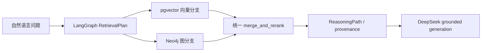

# P2-I 独立知识库真实接入与混合检索 v1

## 范围

P2-I 将当前已生成的 65 篇全文资产接入两个独立知识库：

```text
65 篇全文 / 3617 chunks
        ├─ PostgreSQL + pgvector：文献元数据、chunk、Gemini embedding
        └─ Neo4j：版本化实体、关系、断言、证据 chunk 绑定
```

两者都不是业务事实库。Python Runtime 不直接访问 `patient_data_manager`，样本、
患者和丰度事实仍只能经过 Java 受控工具。

## 数据资产

- 文献范围：当前 65 篇全文，不混入只有元数据的记录；
- 向量模型：`gemini-embedding-2`；查询和文档使用非对称检索前缀；
- 关系图：版本化 JSONL staging 资产；每条语义关系绑定 graph version、build run、
  assertion status、confidence、evidence chunk；
- 默认图版本：保持现有 v3；新 v4 必须经过 P2-H 审核后切换。

## PostgreSQL + pgvector

固定连接变量：

```text
MICO_KNOWLEDGE_VECTOR_ENABLED=true
MICO_KNOWLEDGE_VECTOR_DATABASE_URL=postgresql://.../mico_knowledge
MICO_KNOWLEDGE_VECTOR_DIMENSION=3072
```

只允许独立知识库名称 `mico_knowledge`，拒绝业务库名、Runtime 状态库名、查询参数
和 fragment。初始化由 `vector_schema_sql()` 产生固定 schema，包含：

- `knowledge_index_manifest`；
- `knowledge_document`；
- `knowledge_chunk`；
- HNSW halfvec cosine 索引；
- chunk 文本检索和 document/chunk 关联索引。

导入脚本只使用 JSONL 资产和参数绑定，不接受自由表名或 SQL。重复执行采用固定
document/chunk 主键 upsert，目标仅限 `mico_knowledge`。

## Neo4j

固定连接变量：

```text
MICO_KNOWLEDGE_GRAPH_ENABLED=true
MICO_KNOWLEDGE_NEO4J_URI=bolt://127.0.0.1:<port>
MICO_KNOWLEDGE_NEO4J_USER=<injected>
MICO_KNOWLEDGE_NEO4J_PASSWORD=<injected>
MICO_KNOWLEDGE_GRAPH_VERSION=<explicit-version>
```

导入只写 `KnowledgeEntity`、`KNOWLEDGE_RELATION` 和 `KnowledgeGraphBuild`。所有
Cypher 均固定，版本和行集合通过参数传入；不会执行自由 Cypher，不会删除其他图版本。
重建只删除同一 `graphVersion` 的知识图；旧版本保留用于回滚。

`ingest_graph_versioned.py` 的普通模式只写入 staging/review 状态。`--publish` 只有
在 manifest 已由 `approve_graph_manifest` 写入 queue-bound approval marker 后才允许，
不能靠命令行参数绕过人工审核。

检索还要求 Neo4j 中同一版本存在 `KnowledgeGraphBuild.status = 'published'`。因此
`review_pending`、`approved` 或 `staging` 版本即使已经导入，也不能被默认检索；v3
基线导入时会登记为 `published`，v4 导入后保持 `review_pending`。

## 真实检索链



动态路由只决定 `vector`、`graph` 或 `hybrid` 分支和查询类型；它不能生成数据库
连接、表名、自由 Cypher 或改变图版本。图分支最多 3 跳，所有关系必须带证据 chunk，
冲突/推测路径保留状态并进入审核边界。

当 `MICO_KNOWLEDGE_VECTOR_ENABLED=true` 和 `MICO_KNOWLEDGE_GRAPH_ENABLED=true` 同时
存在且未显式指定其他 backend 时，Runtime 自动选择独立 database backend；只有未启用
真实存储时才使用显式的 JSONL local backend，避免主链路默默绕过 pgvector/Neo4j。

## 运行顺序（部署时执行）

1. 使用 `docker-compose.knowledge.yml` 创建仅绑定 loopback 的 PostgreSQL 和 Neo4j；
2. 只注入环境变量和密钥管理系统中的凭据，不写 `.env` 或仓库；
3. 初始化 pgvector 固定 schema；
4. 导入 65 篇全文的向量和 chunk；
5. 导入已发布的 v3 baseline；
6. 导入 v4 staging 图并生成 `GraphReviewQueue`；
7. 写入 queue-bound publication approval；
8. 重新执行带 `--publish` 的版本导入，使 Neo4j build 进入 `published`；
9. 更新 manifest/registry 的发布状态，再将 `MICO_KNOWLEDGE_GRAPH_VERSION` 指向已发布版本；
10. 启动 Runtime 后用内部测试请求验证 vector、graph、hybrid 三路事实来源。

任何一步失败都停止，不回退到业务库、不自动删除旧图、不伪造发布状态。

## 当前完成与未完成

已完成代码边界：独立配置、固定 schema、65 篇全文资产导入器、版本化 Neo4j 导入器、
真实 Vector/Graph/Hybrid retriever、统一重排和发布审批门禁。当前本地隔离存储已完成
首次真实导入：pgvector 保存 65 个文献向量和 3617 个 chunk；Neo4j 保存 v3 已发布
基线（5238 节点、24341 条边）和 v4 待审核版本（5238 节点、24341 条边）。v4
审核队列为 280 条，尚未批准或发布。

真实 pgvector + Neo4j 混合检索已通过集成测试；测试使用已入库的 embedding，不调用
外部 Gemini API。仍需人工审核 v4 关系、完成显式批准后再发布；评测、A/B、成本测试
和 bad-case 回归仍留到最后。
