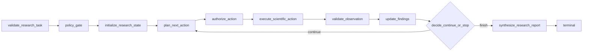

# P2-J0：科研探索 Agent 契约 v1

状态：契约与内存版通用科研动作循环已落地；真实 Java 数据执行仍只经受控 `execute_read_query`，不开放自由数据库连接。

## 目标

P2-J0 为后续 Scientific Exploration Agent 冻结闭合的数据模型。模型只选择受控的科研动作；Java 仍是业务事实源，Python 不直连 `patient_data_manager`，也不把 SQL、表名、locator 或原始 Java payload 作为动作参数。

## 主要模型

`ResearchTask` 是一次探索请求，包含任务身份、研究问题、授权 scope、允许动作和动作预算。`ResearchPlannerContext` 是给规划器的脱敏上下文，仅包含问题摘要、已批准动作和剩余预算。

`ScientificAction` 是带 `actionName` discriminator 的闭合联合，当前只固定通用执行能力，不固定疾病、队列或统计方法：

- `execute_read_query`：模型生成 SQL 草案，最终由 Java 只读策略校验和执行；
- `inspect_cohort`：元数据优先的动态只读探查，仍经 Java `execute_read_query` 边界；
- `compare_groups`、`stratified_analysis`、`adjust_confounders`、`cross_project_validate`、`cross_disease_validate`：只引用已验证 Observation，由 Python 受限分析执行；
- `retrieve_evidence`：使用脱敏主题走 vector/graph/hybrid GraphRAG；
- `analyze_projection`：对已验证、有界 Observation 生成受限 Python 分析；
- `finish`：以固定停止码结束。

SQL 只允许出现在 `execute_read_query` 的专属参数模型中；其他动作不接受 SQL、任意表名、任意 WHERE 片段、数据库 URL、`patientId`、`subjectId`、`sampleKey` 或完整样本定位器。实际执行仍需经过 Runtime policy 和 Java 受控工具。

## Observation 与证据绑定

`Observation` 只保存元数据和受控汇总：来源、查询哈希、行数、版本、批次、缺失/排除计数，以及可选的 Java transient snapshot。它不包含 Java `data`、原始疾病标签、样本 accession、`sourceSampleId` 或 `internalRecordId`。

所有 Java snapshot 都必须标记：

```text
snapshotPersistence=transient
replayable=false
```

`ResearchEvidenceBinding` 将观察结果与不透明 evidence/document/path 引用绑定，`ResearchFinding` 和 `ResearchReasoningStep` 只能引用已存在的 binding。这样报告可以追踪证据来源，但不会把原始数据投影到对外契约。

## LangGraph 目标循环



循环由动作预算、重复动作签名、观察质量、证据充分性和错误状态共同控制。默认上限为 6 次，绝不无限循环。

## 当前范围与下一步

Java 业务侧不新增固定疾病/队列工具；当前事实查询统一经动态 `execute_read_query`，另外提供元数据-only 的 `describe_read_schema` 以便规划器读取版本化语义目录。Python 已有可编译的 LangGraph State → Action → Observation 循环，并在首次合法科研运行前通过 `JavaSchemaCatalogPort` 加载闭合目录；目录失败会 fail-closed。Trace/Evidence 持久化边界、vector/graph/Java 证据统一绑定、通用动态分析动作和证据约束生成已接入；后续是基于真实远程只读链路的多主题验证与性能治理，不是增加某个疾病的固定分支。

所有计数继续使用内部业务记录数或样本键数；`patient_id` 不等于 Subject ID，也不等于独立真实患者数。科研输出必须带固定的非诊断声明。
